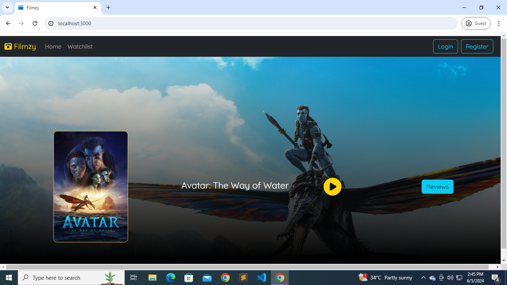
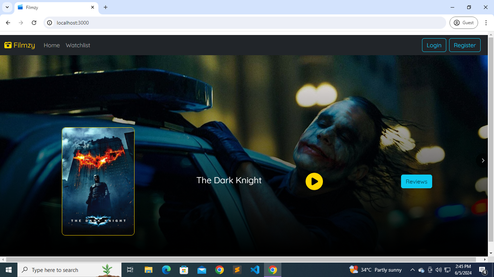
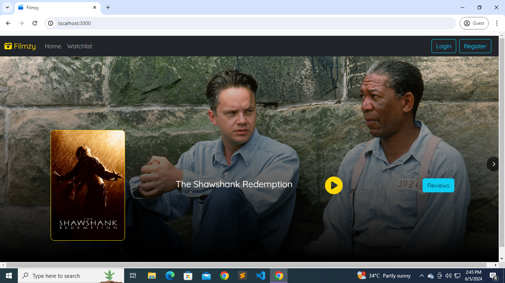
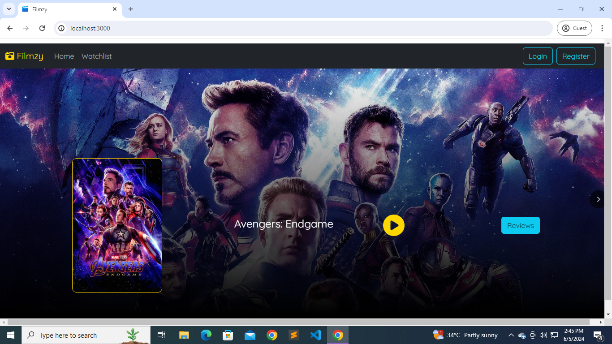
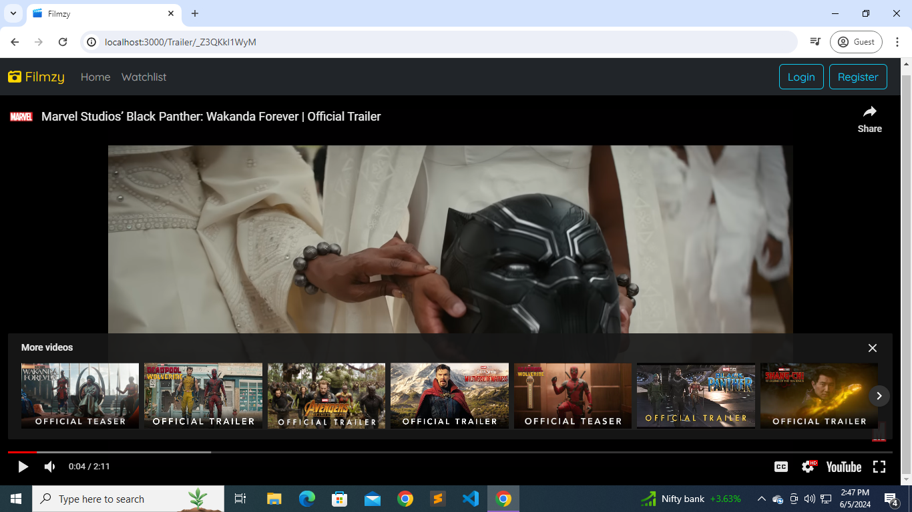
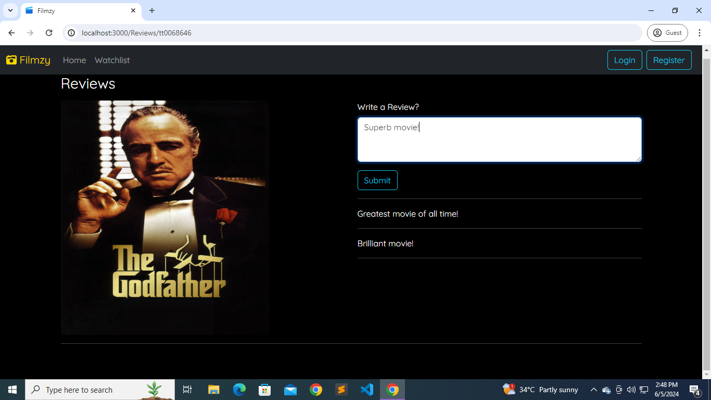
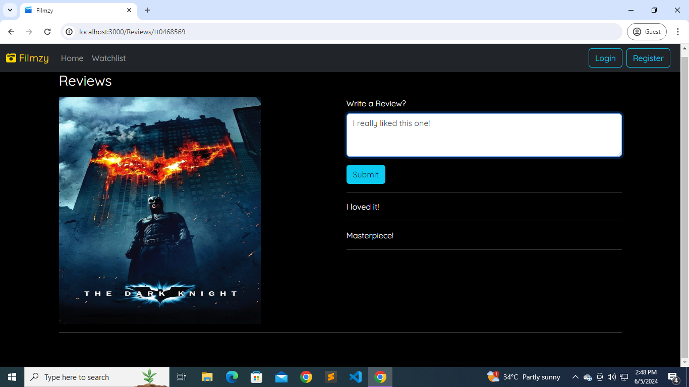

# Filmzy 🎬

Welcome to **Filmzy** – your ultimate destination for exploring, reviewing, and discussing movies! This platform allows you to browse a wide range of movies, watch trailers, and share your thoughts through reviews. Built with **React** on the frontend, **Java Spring Boot** on the backend, and **MongoDB** for the database.

## Table of Contents

- [Features](#features)
- [Screenshots](#screenshots)
- [Installation](#installation)
- [Usage](#usage)
- [Technologies Used](#technologies-used)
- [Contributing](#contributing)
- [License](#license)

## Features

- **Movie Carousel**: Browse through a dynamic carousel of movies with posters and backdrops.
- **Trailer Playback**: Watch movie trailers directly on the platform.
- **User Reviews**: Write and read reviews for movies.

## Screenshots

### Home Page








### Trailer Playback




### User Reviews





## Installation

### Prerequisites

- Node.js
- npm
- Java Development Kit (JDK)
- MongoDB

### Frontend Setup

1. Clone the repository:
   ```sh
   git clone https://github.com/yourusername/filmzy.git
   cd filmzy/frontend

## Usage

1. Open your browser and navigate to `http://localhost:3000` to start using Filmzy.
2. Browse through the carousel, watch trailers, read and write reviews.
3. Enjoy discovering new movies and sharing your thoughts!

## Technologies Used

- **Frontend**: React, React Router, React Player
- **Backend**: Java Spring Boot
- **Database**: MongoDB

## Contributing

We welcome contributions! Follow these steps to contribute:

1. Fork the repository.
2. Create a new branch (`git checkout -b feature/your-feature`).
3. Commit your changes (`git commit -m 'Add some feature'`).
4. Push to the branch (`git push origin feature/your-feature`).
5. Open a Pull Request.

Please ensure your code follows our coding guidelines and includes relevant tests.

## License

This project is licensed under the MIT License - see the [LICENSE](LICENSE) file for details.

